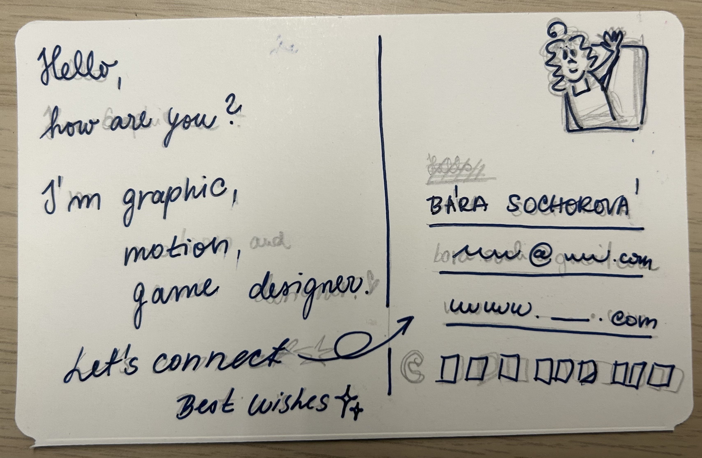

# Business card 🪪
### Let’s Get Down To Business

As part of this assignment, we created a business card that introduces who we are and how to contact us. The goal was to catch attention and leave a clear impression.

I wanted to present myself in a fun and playful way. That is why I designed my business card to feel more funky. The card is inspired by a postcard. It also features my own illustration, used as a postage stamp.

