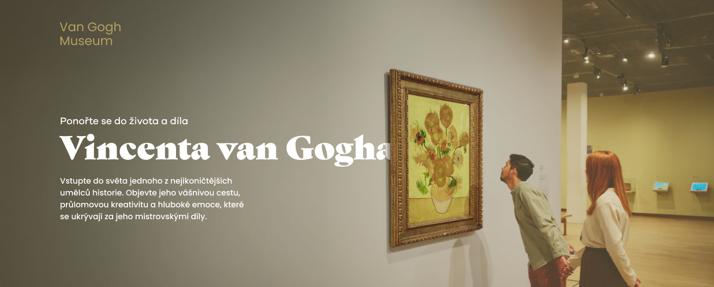
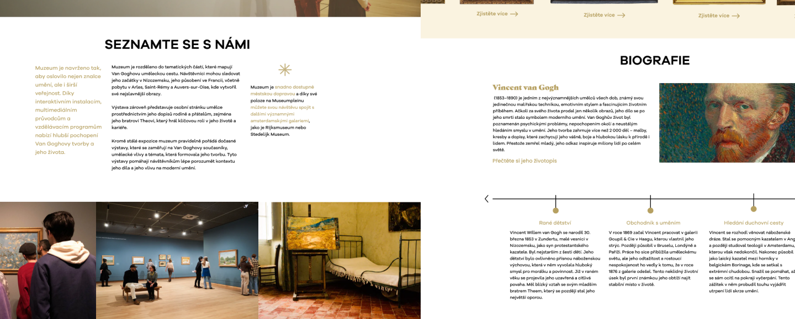
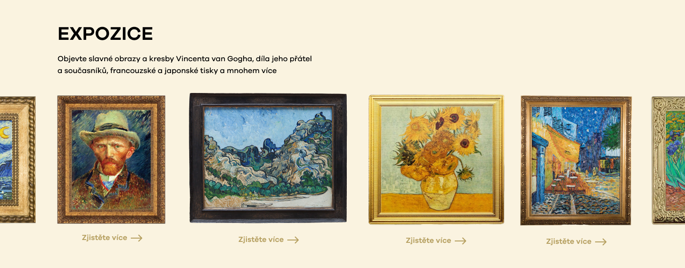
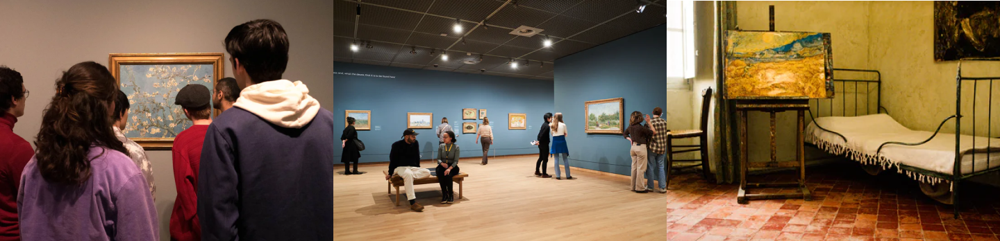
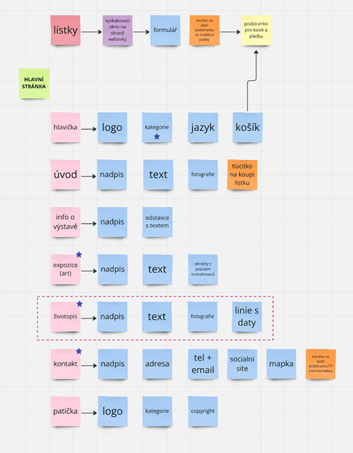
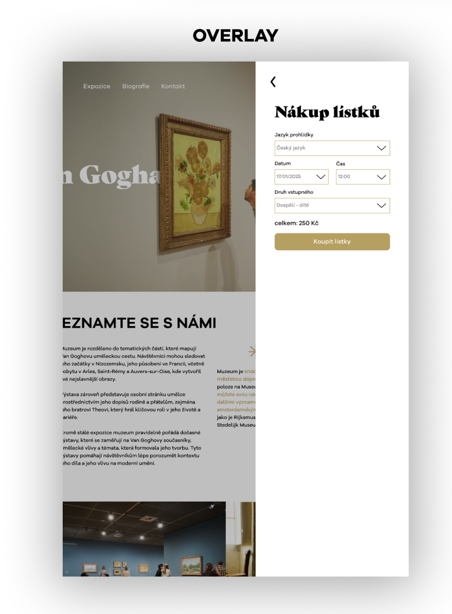
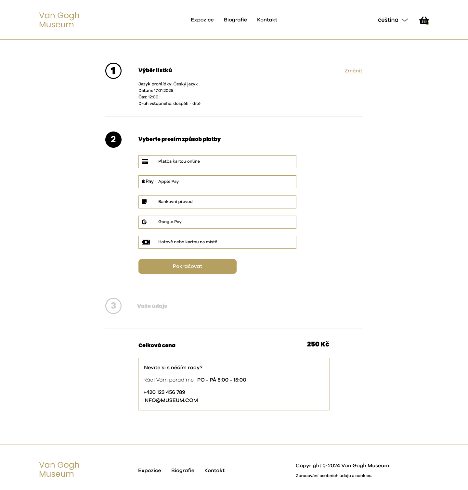
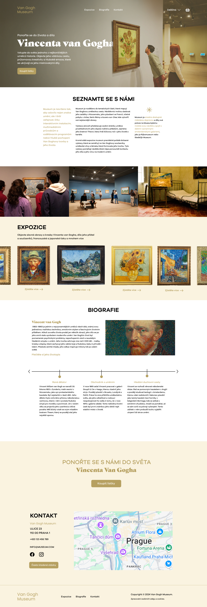

# How can I make it simpler, but still creative?

### Designing an experience inspired by the world of Vincent van Gogh

⬇️ Whole website at the end

## 🟡 Overview

This project is a design of a modern website for a fictional Van Gogh Museum.
The goal was to create a clear and engaging experience that presents Vincent van Gogh’s life and work.

I wanted the website to feel as thoughtful and emotional as the artwork, while still being easy to use.

Users can explore artworks, exhibitions, and key information in a simple and natural way.

## 🔴 Problem

While researching existing museum websites, I noticed that many of them feel dense, outdated, and difficult to navigate. Instead of experiencing art naturally, users are often overwhelmed by large amounts of content, confusing layouts, and overly complex interactions. 
*“Should I scroll up, down, left, or right? What’s going on?”*

This project became an exploration of how a museum website could feel different.

More immersive.  
More intentional.  
More human.

## ⚪ Design Goal

The primary goal was to design a website that introduces visitors to Vincent van Gogh’s world in a simple and engaging way.

I wanted the experience to feel:
- calm
- elegant
- immersive
- emotionally driven
- easy to navigate

The design focuses on:

- reducing visual clutter  
- simplifying navigation  
- improving hierarchy  
- creating stronger storytelling  
- making the ticket flow intuitive

> ⚪ “The goal was to make art feel accessible through simplicity.”

---

## ⚪ Visual Inspiration

The visual direction of the project was inspired directly by Vincent van Gogh’s paintings.

I focused mainly on:
- warm golden tones
- soft neutral backgrounds
- elegant contrast
- immersive imagery
- framed compositions
- editorial-inspired layouts

# ⚫ Design Process

🟡 Research → ⚫ Structure → ⚪ Wireframes → 🟡 Final UI

## 🟡 Analysis

The first phase focused on understanding the common problems of museum websites and identifying user needs.

Key findings included:

- users need quick orientation  
- navigation should remain predictable  
- artwork should remain the main focus  
- content needs stronger visual hierarchy

This phase helped establish the UX direction of the project.

---

## ⚪ Definition

After the research phase, I defined the core structure and functionality of the website.

This included:
- sitemap planning
- content hierarchy
- navigation structure
- user flow organization
- page structure

The main objective was to reduce complexity and create a more intuitive browsing experience.

# ⚫ Wireframes & Content Structure

Before creating the final interface, I developed low-fidelity layouts and content structures to test hierarchy and spacing.

This phase helped define:

- placement of navigation  
- content priorities  
- visual rhythm  
- user flow between sections  
- CTA positioning

The wireframes ensured that the final interface would remain clear and user-friendly.

---

# 🟡 Additional Screens

# Ticket Purchase Experience

The overlay helps users choose tickets without leaving the page.

Users can stay focused and make a decision without losing context. If needed, they can easily return to the same place.

This keeps the experience smooth and reduces frustration.

After that, users move to a separate page to complete the purchase without distractions.

# Form Design

The form is simple and easy to use, with a focus on clarity and quick interaction.

# 💡 Reflection
This project helped me focus on clear and simple design.

I learned how to:
- structure content in a better way
- reduce visual clutter
- guide users through design
- I also understood how important storytelling is in design. Every decision should support the idea and the user experience.

If I continued this project, I would test it with real users and improve accessibility.

[Check the prototype](https://www.figma.com/design/33pvVdrOXbVfhKUacDYunR/DD_share?node-id=0-1&t=7B3TlRwKlCVCCFKv-1)

---

Bára Sochorová | whimsical designer | [Portfolio](https://sochorova.myportfolio.com/)

---

