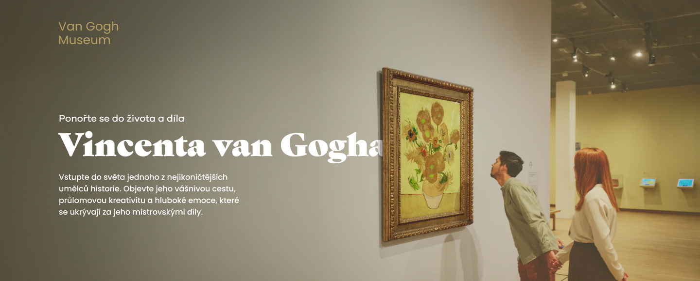
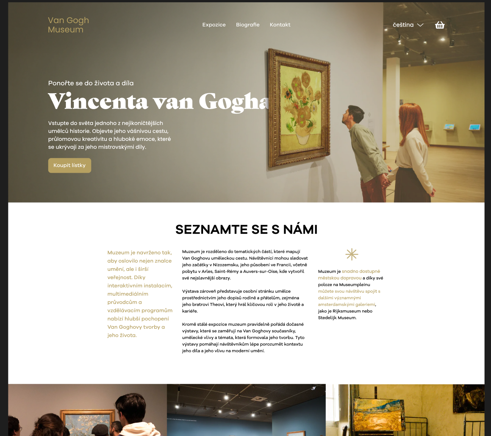
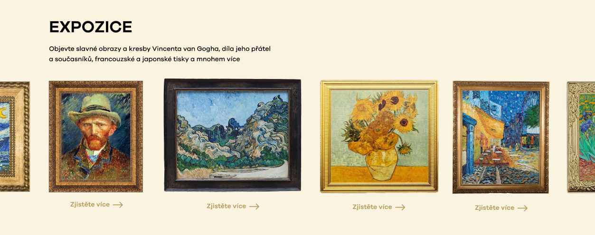
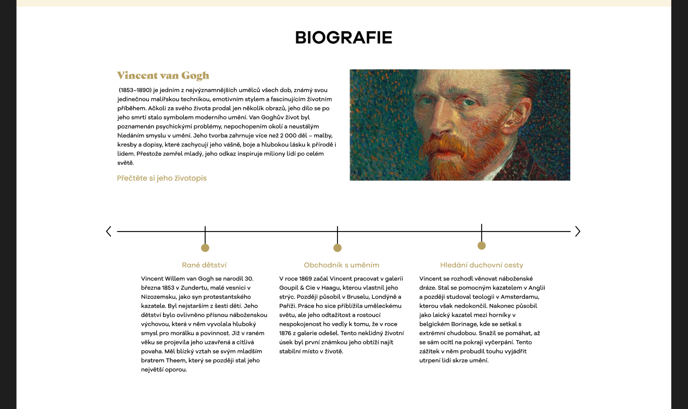
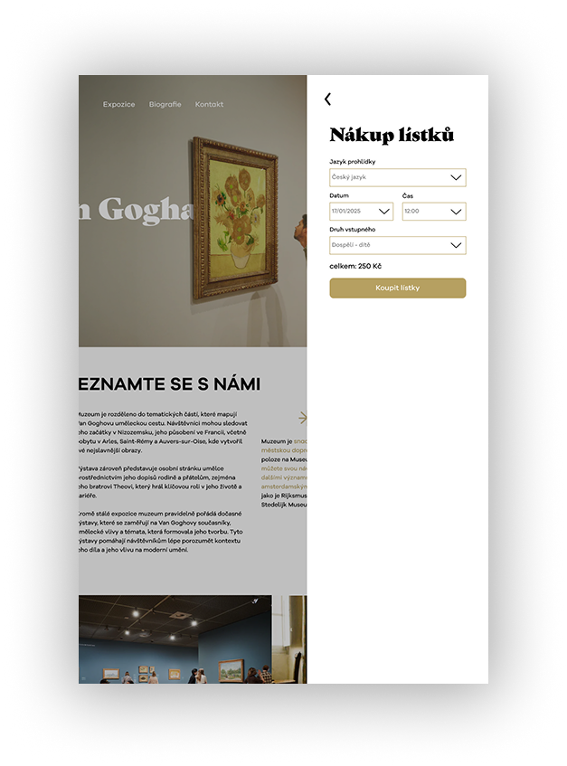
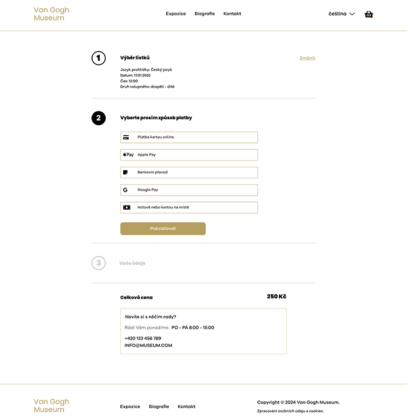

# Van Gogh Museum – Website Design Case Study

## 🟡 Project Overview

This project is a design of a modern website for a fictional Van Gogh Museum.
The goal was to create a clear and engaging experience that presents Vincent van Gogh’s life and work.

I wanted the website to feel as thoughtful and emotional as the artwork, while still being easy to use.

Users can explore artworks, exhibitions, and key information in a simple and natural way.

## 🔴 Problem

Many museum websites are hard to use.
They often feel messy, outdated, or too complex.

Users often struggle to:

* find important information
* understand how the site is structured
* stay engaged with the content

Because of this, the digital experience often does not match the quality of the artwork.

## 🟢 Goal

The goal was to design a website that:

* is easy to navigate and helps users find key information
* guides users through the content in a natural way
* looks clean and modern
* keeps the focus on the artwork

## 🔵 My Role

UI/UX Designer – I was responsible for:

* research
* concept development
* wireframing
* visual design

---

## 🔍 Research & Inspiration

I reviewed several museum websites to understand how they work.

I noticed common issues:

* weak structure
* confusing navigation
* too much text

I focused on how to simplify the experience and make it easier to use.

## 🧠 Concept

The concept was to create a **calm, gallery-like digital experience without losing clarity and usability**.

I wanted to avoid overwhelming layouts and instead create space and focus.

The design aims to:

* feel like a real museum space without being overwhelming
* highlight artwork through spacing and layout
* use simple and warm visual elements

## ⚙️ Process

### 1. Analysis

I looked at how users interact with museum websites and defined key content areas:

* exhibitions
* artist biography
* ticket purchase
* contact information

### 2. Definition

I organized the content into clear sections and created a simple user flow:

* landing → exploration → action (tickets)

The goal was to make key actions easy to find and reduce extra steps.

### 3. Design

I translated the concept into a clear visual system.

I focused on layout, spacing, and typography to guide the user in a natural way.

---

## 🎯 Key Design Decisions

### Layout

I used a grid to keep the layout clear and consistent.
More space helps reduce clutter and improves focus.

### Colors

I chose warm neutral tones to create a calm, gallery-like atmosphere.
These colors support the artwork instead of competing with it.

### Typography

I used a more expressive serif font in selected places to catch attention.

This font appears only on key elements, such as highlights or important headings.

For the rest of the content, I used a clean and readable font.
This keeps the text easy to read and scan.

### Imagery

Large images help create a strong visual experience and keep the focus on the artwork.

---

## 🧩 Design System

### Grid

* 12-column layout
* consistent spacing system

### Colors

* Primary: warm beige
* Secondary: light neutral tones
* Accent: dark contrast

### Typography

* Creative heading: serif – Gastromond
* Body text and UI: Galano Grotesque

---

## 🖥️ Final Design

### Homepage

The homepage gives a clear starting point and introduces the museum.

---

### Exhibition Section

This section presents artworks in a clear and structured way.

---

### Biography Section

This section tells the artist’s story in a simple and engaging format.

---

## 🧪 Additional Screens

### Overlay / Modal

The overlay helps users choose tickets without leaving the page.

Users can stay focused and make a decision without losing context.
If needed, they can easily return to the same place.

This keeps the experience smooth and reduces frustration.

After that, users move to a separate page to complete the purchase without distractions.

---

### Form Design

The form is simple and easy to use, with a focus on clarity and quick interaction.

---

## 💡 Reflection

This project helped me focus on clear and simple design.

I learned how to:

* structure content in a better way
* reduce visual clutter
* guide users through design

I also understood how important storytelling is in design.
Every decision should support the idea and the user experience.

If I continued this project, I would test it with real users and improve accessibility.

---

## 📁 Tools

* Figma
* Adobe Photoshop
* Illustrator
