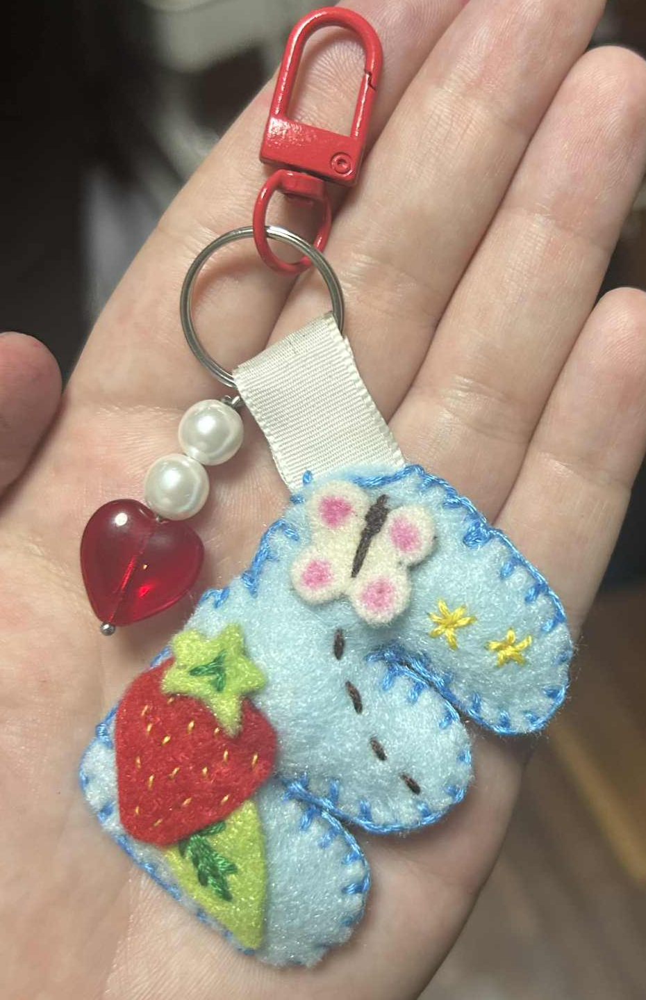

[⬅️ go back](../README.md)

# Character 🩵

For our first class exercise, we had to create a stylized letter. I wanted to make something I wouldn’t just throw away, so I chose to create a letter keychain for my younger sister. I picked the letter E, the first letter of her name.

I made the letter from a fabric called felt. First, I printed a paper template and traced it onto the fabric twice. Then I added patterns and stitched small details onto the front piece. After that, I sewed the two parts together and filled the inside with stuffing. Finally, I sewed on a fabric loop and added a key ring. I decorated it with charms. Then I clipped on a red hook so it can be attached to a bag or to keys.

It turned into a great little gift, and my sister was thrilled with it. ❤️

