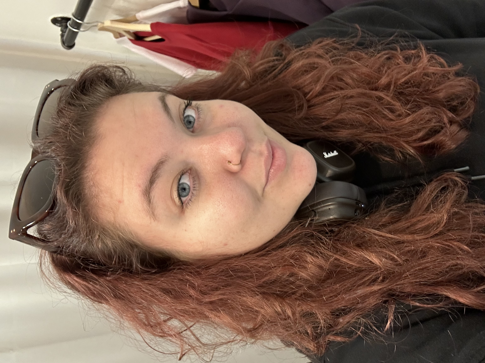

# First Impressions ✴️

In the previous assignment, we designed a paper business card. This became the starting point for our handshake and About page. Together, these elements create a strong first impression and clearly show who we are.

## Handshake

Versions: 
- My name is Bára Sochorová and I am a graphic-motion-game designer.
- My name is Bára Sochorová and I love to do everything and nothing at the same time! It can sound weird, but Its completly true!
I am primarily a graphic designer. But I am very passionate, so from time to time I love to explore and learn new things like motion design, game design, coding and so on.

### Actual version:

My name is Bára Sochorová and I love to do everything and nothing at the same time! Sounds weird? Well… it is, but that’s just who I am.
I’m a primarly graphic designer, but I love to explore new things! One day I animate, the next I try game design, and sometimes I convince myself I can code.

## About me

Hi, I’m Bára. I’m a graphic designer who loves doing everything and nothing at the same time. Sounds strange? Maybe. But that’s how my creativity works.

Fun fact: I first wanted to be a teacher. Then I found programming. And now I design things. Life is weird, but I like it this way.

I design visual identities and digital interfaces. I also animate, try game design, and sometimes convince myself I can code. I like to explore new tools and ideas. I get bored when things stay the same.

I studied at a technical secondary school, so I think about design in a practical way. I care about how things work, not only how they look. That’s why I enjoy UX/UI design. It connects logic with creativity.

Right now, I focus on UX/UI and I’m taking a game design course. I like creating worlds, systems, and experiences that people can enjoy and understand.

For me, design is a playground. A place to test ideas, make mistakes, and learn new things. In the future, I want to work on projects that make people feel something! 👽

