[⬅️ go back](../../README.md)

# Storytelling

### In this storytelling presentation, I wanted to focus on my bachelor’s thesis and the thoughts and ideas behind it. I hope you enjoy it, and if you would like to see the PDF version, you can check it out at the end of this page.

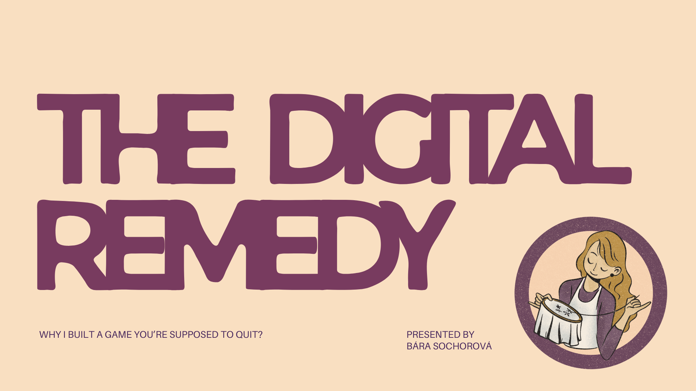

Hello everyone, my name is Bara, and today I would like to talk about The Digital Remedy or, in other words, why I built a game you’re supposed to quit.

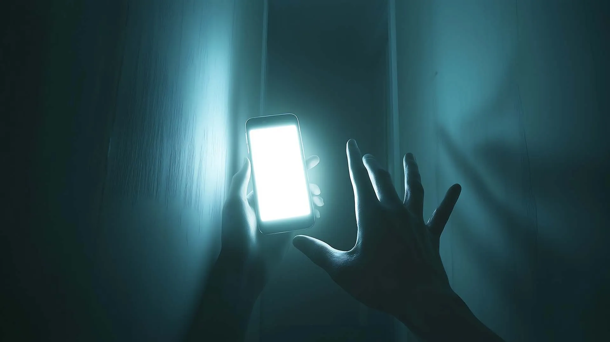

First, let me ask you a question: how much time have you spent today scrolling on your phone?
Personally, I spent a lot of time scrolling. I’m not proud of it, but I do it a lot. And I think this is one of the biggest problems of our generation — and also of younger and older generations. We are stuck on our phones. We are disconnected from reality, and I think that’s a huge problem.

As I already said, I think this problem affects all generations. I see my younger sister constantly looking at her phone. I see my grandma completely addicted to the games on her tablet that are designed to keep her attention all the time. And of course, it’s also a problem for our generation, because we use our phones constantly.

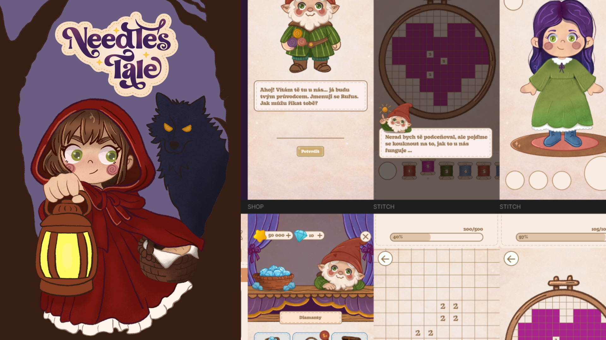

That’s why I created a game called Needle’s Tale. My main goal was to bring cross-stitching as a hobby to more people, so they can become more present in what they are doing.

I know it may sound like a paradox, but I feel that we are already so connected to our phones that we need something that starts on our phones and then brings us back to reality. I think hobbies are very important for us today and for our present lives.

And that’s why I created Needle’s Tale — to introduce more people to cross-stitching. They can start with the game on their phones, where they click on squares and create cross-stitch patterns in a digital world, but later they can make those same patterns in real life.

I think that’s really interesting because it helps people reconnect with their hands, their bodies, and the present moment.

I will talk about the design later on.

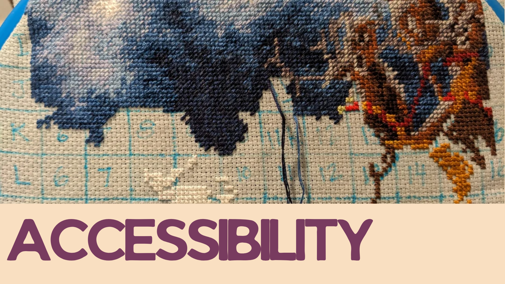

One thing that was very important to me when I started designing this game was accessibility, because cross-stitching can feel very overwhelming. In the picture, you can see an interesting pattern or artwork in real time, but when you look closely at the grid, you realize that one square can contain hundreds of stitches. You have to change colors all the time, and it can quickly become overwhelming. People may get bored or give up.

So when I started creating this game, I knew I had to make the patterns simple, so people could stay engaged, not get bored, and actually enjoy the process. That’s why I wanted the patterns to be small, easy, and approachable.

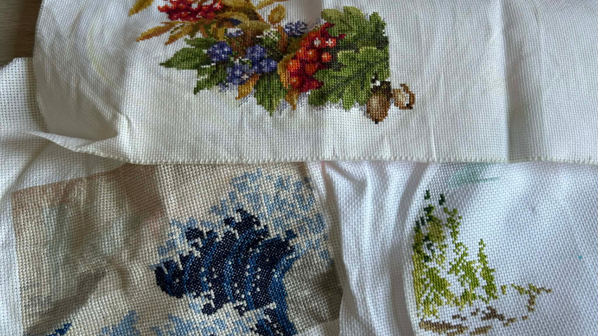

Here you can see some of my personal cross-stitch projects that I never finished because, as I already said, I sometimes got bored. I couldn’t really see quick progress or feel that the project was moving forward, which made it harder to stay motivated and continue working on it.

So I have personal experience with this problem!

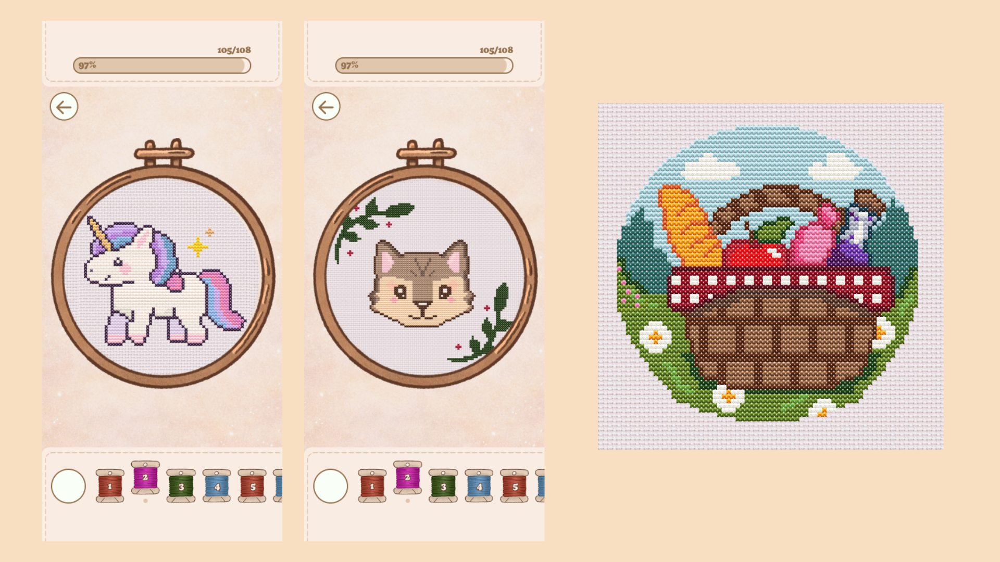

Here you can already see some examples of my patterns. As you can see, they are very simple and quick to make. In the digital version, you can spend just a few minutes creating a pattern, while in real life you might spend one afternoon or one weekend working on it, and you can still see quick progress.

On the right side, you can see one of the first cross-stitch patterns I ever made, and I would like to tell you something about it.

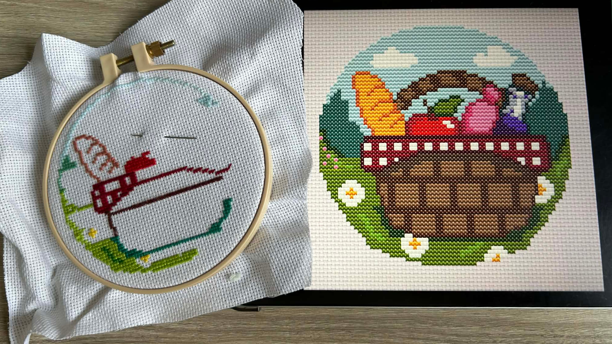

Here you can see the first cross-stitch pattern I ever created. At first, I was really proud of it, but later I realized that I had made it way too big and too complicated. I added too many details because I thought it would still be an easy pattern.

But when I actually tried to make it in real life, I spent a lot of hours on it and completed only this small part, which, as you can see, is not much at all.

That experience made me realize that I needed to make my patterns simpler, let go of my ego a little bit, and focus on making the whole process easier and more enjoyable.

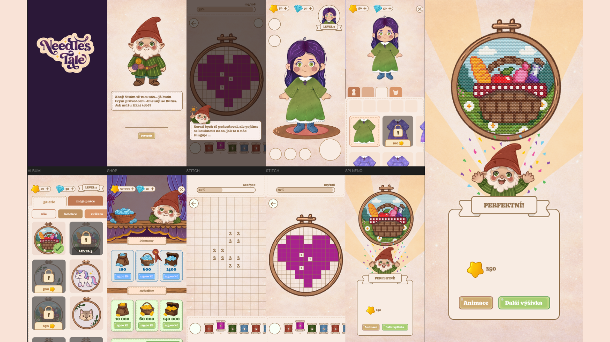

Now let’s focus more on the app, or the game itself. As you can see, the game was heavily inspired by fantasy and fairy tales. I wanted it to be colorful, but still warm and cozy, so it could be eye-catching while also making people feel comfortable and at home when they play it.

I created a lot of illustrations for the game, and I’m very proud of them. I think the whole game looks really cute, and that was one of my main goals.

From the beginning, I also knew that I didn’t want to use dark patterns in the design. Of course, I wanted people to enjoy the game and spend time with it so they could relax through this digital form of cross-stitching, but I didn’t want to make them addicted to it or keep them trapped on their phones.

At the same time, I did use some light motivational patterns, because I wanted the experience to feel enjoyable and rewarding. For example, when you finish a pattern, you see a cute animation where the dwarf is happy and confetti appears on the screen, so you get a satisfying feeling after completing it.

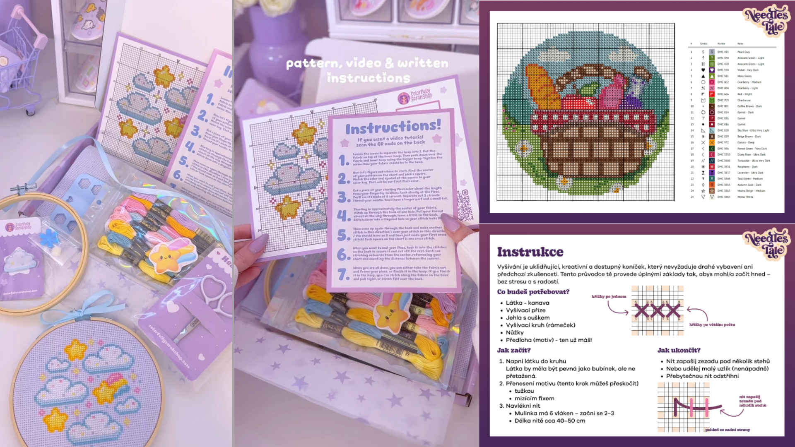

As I already mentioned, I wanted to bring cross-stitching into people’s real lives as well. That’s why part of my bachelor’s thesis was also creating a cross-stitching box that people could buy together with their favorite patterns.

The idea was that they would receive a box with everything they need to start — threads, needles, maybe scissors, printed patterns, and other materials — so the whole process would feel easy and accessible for beginners.

Unfortunately, I didn’t have enough time to create the boxes in real life, but on the right side you can see my concept and instructions for how they could look. I personally really like this idea, and I think it’s a nice way to introduce people to this cute hobby.

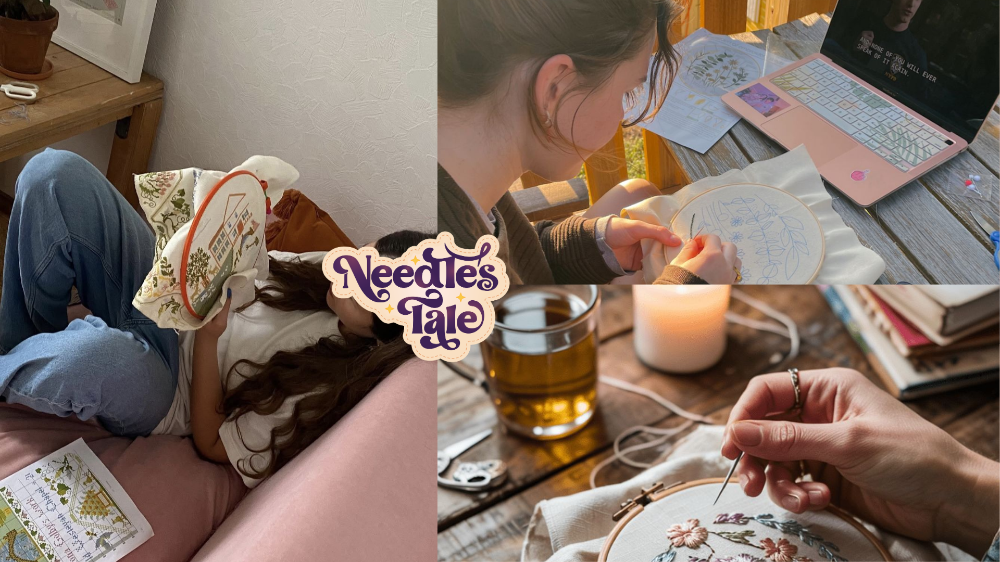

At the end of my presentation, I would just like to encourage you to try this amazing hobby, to be more present in the moment, and to reconnect with your body and your hands again. Maybe we don’t always need to spend so much time using digital products.

So yeah, I think that would be my final message.

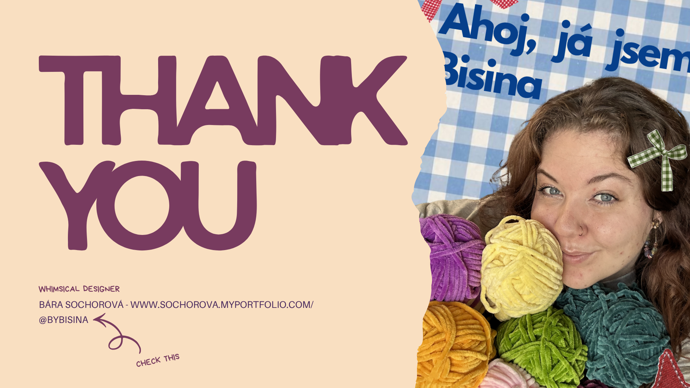

Thank you so much for your attention. Here you can connect with me, and if you are interested in more hobby-related or craft-related content, you can check out my Instagram. Right now, I focus mostly on crocheting, but I would also like to create more cross-stitch content in the future.

So yeah, that’s all from me. Thank you so much.

---

[Here you can check my presentation in pdf version!](presentation.pdf)
