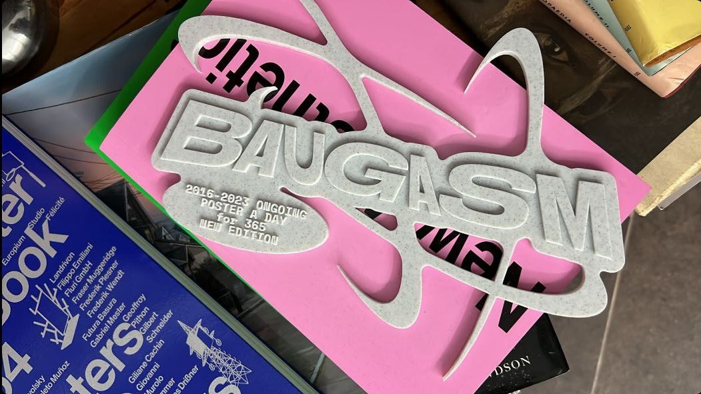

[⬅️ go back](../../README.md)

# What I learned today ...

## What If Graphic Design Could Become Real?

Hello everyone,

today I want to talk about 3D printing in graphic design.

Most graphic design stays on screens or paper. We see logos, posters, websites, and ads every day. But 3D printing can turn digital designs into real objects.

Designers can print:

logos,
letters,
packaging,
models,
decorations,
and small art pieces.

This helps designers see their ideas in real life. They can touch the design, test it, and improve it before the final version.

For example, a café can use a 3D printed logo on a wall. A company can make 3D signs for shops or events. Some designers even create business cards with 3D details.

3D printing gives designers more freedom. They do not have to think only in 2D. They can create shapes and objects that people can hold in their hands.

It can also make advertising more interesting. Imagine a poster with 3D parts or a logo that comes out of the wall. People notice things like this much faster because it feels more real.

Another good thing is that 3D printing is not only for big companies. Students, artists, and small creators can use it too. Many objects are cheap to print, but they can still look creative and professional.

Designers often use programs like Blender, but there are many other tools for 3D design. People can also download free models from websites like Printables and change them to create their own ideas. This makes 3D printing easier for beginners.

The Czech Republic is also well known in the world of 3D printing because of Prusa Research. The company makes popular 3D printers that are used by people all around the world.

I think 3D printing is exciting because it connects art and technology. It also changes the way people experience graphic design.

Maybe one day graphic design will not only be something we see, but also something we can touch.

Thank you for listening.

